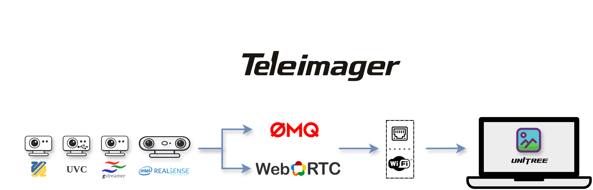

<div align="center">
  
  <a href="https://www.unitree.com/" target="_blank">
    
  </a>
  <p align="center">
    <a> English </a> | <a href="README_zh-CN.md">中文</a>
  </p>
  <p align="center">
    <a href="https://github.com/unitreerobotics/xr_teleoperate/wiki" target="_blank"> </a> <a href="https://discord.gg/ZwcVwxv5rq" target="_blank"> <a href="https://deepwiki.com/unitreerobotics/teleimager"></a> </a>
  </p>
</div>
[**TeleImager**](https://github.com/unitreerobotics/teleimager) is Unitree's image service: a **server** captures video from multiple cameras (UVC, V4L2, GStreamer, RealSense) and publishes it over the network via **ZeroMQ** or **WebRTC**, while a **client** subscribes and decodes those streams. It powers the teleoperation video pipeline of [xr_teleoperate](https://github.com/unitreerobotics/xr_teleoperate).

## ✨ Features

- 📸 Multiple UVC / V4L2 / GStreamer / Intel RealSense cameras
- 📢 Publish frames over **ZeroMQ PUB-SUB** (high quality, LAN) and **WebRTC** (low latency, browser)
- 💬 Serve image-config commands over **ZeroMQ REQ-REP**
- 🆔 Five camera identifiers: physical path, serial number, bcd_device, vid_pid, video path
- ⚙️ Configurable resolution and frame rate
- 🚀 Efficient frame handoff via a triple ring buffer

---

## 1. 📦 Installation

TeleImager has **two roles** — install only what you need:

| Role | What it does | Where it runs |
|------|--------------|---------------|
| **Client** | Subscribes and decodes streams (teleoperation, data recording, your own CV code) | Workstation / robot host |
| **Server** | Captures from cameras and publishes over ZMQ/WebRTC | The robot/device the cameras are plugged into |

### 1.0 System prerequisite (both roles)

Both roles do JPEG encode/decode through **PyTurboJPEG**, a ctypes binding that loads the system library **libjpeg-turbo (3.0+ required)** at import. pip cannot install this native library — do it once per machine. Pick one:

**Method 1 — Conda (recommended, cross-platform)**

```bash
conda install -c conda-forge libjpeg-turbo
```

**Method 2 — Homebrew (macOS)**

```bash
brew install jpeg-turbo
```

<details>
<summary><b>Method 3 — Build from source (Ubuntu/Debian)</b></summary>
```bash
git clone https://github.com/libjpeg-turbo/libjpeg-turbo.git
cd libjpeg-turbo && mkdir build && cd build
cmake -DCMAKE_INSTALL_PREFIX=/opt/libjpeg-turbo ..
make -j$(nproc) && sudo make install
echo 'export LD_LIBRARY_PATH=/opt/libjpeg-turbo/lib64:$LD_LIBRARY_PATH' >> ~/.bashrc
source ~/.bashrc
```

</details>

> ⚠️ Do **not** install the PyPI package named `turbojpeg` — it is a different, incompatible library. This project uses `PyTurboJPEG` (already pulled in by `pip install teleimager`).
> Ubuntu's `sudo apt install libturbojpeg` is often older than 3.0, so it's not recommended. If the library is missing, TeleImager raises a detailed install hint equivalent to the above on first import.

### 1.1 Environment (conda)

```bash
# Install Miniconda (skip if already installed). Use the aarch64 installer on Jetson/ARM.
mkdir -p ~/miniconda3
wget https://repo.anaconda.com/miniconda/Miniconda3-latest-Linux-x86_64.sh -O ~/miniconda3/miniconda.sh
bash ~/miniconda3/miniconda.sh -b -u -p ~/miniconda3 && rm ~/miniconda3/miniconda.sh
source ~/miniconda3/bin/activate && conda init --all

# Create and activate the project environment
conda create -n teleimager python=3.10 -y
conda activate teleimager
```

### 1.2 Client install

| You need | Command |
|----------|---------|
| **Headless** — subscribe ZMQ → BGR `ndarray` (feed your own code) | `pip install teleimager` |
| **+ Viewer** — on-screen OpenCV windows | `pip install "teleimager[viewer]"` |

> The viewer pulls in `opencv-python`.

### 1.3 Server install

Pick the driver(s) for your cameras, run one install command, then add certificates at the end if you use WebRTC.

#### 1.3.1 Choose your backend (camera driver)

A *backend* is the capture driver TeleImager uses to talk to a camera. They're lazily loaded, so unused ones cost nothing; start from the base (V4L2 + WebRTC) and stack on what you have:

| Backend (camera driver) | pip extra | Notes |
|---------|-----------|-------|
| Base (V4L2) | `[server]` | Always included, no extra needed |
| + UVC | `[uvc]` | Needs USB access — run [setup_uvc.sh](https://github.com/unitreerobotics/teleimager/blob/main/setup_uvc.sh); the wheel already bundles `libturbojpeg` and `libusb`, no apt needed |
| + RealSense | `[realsense]` |  |
| + Everything (except GStreamer) | `[all]` | Equivalent to UVC + RealSense |
| + GStreamer | no pip package | `sudo apt install python3-gi python3-gst-1.0 gstreamer1.0-plugins-{base,good,bad}` |

#### 1.3.2 Install

Pick your backend (swap the `[server]` below for the matching extra), then choose one of two ways to install:

```bash
# Option 1 — from source (recommended): also gets the helper scripts setup_uvc.sh / setup_autostart.sh and WebRTC assets
git clone https://github.com/unitreerobotics/teleimager.git
cd teleimager
pip install -e ".[server]"        # e.g. ".[uvc]", ".[all]"

# Option 2 — from PyPI (when you don't need the helper scripts)
pip install "teleimager[server]"  # e.g. "teleimager[uvc]", "teleimager[all]"
```

#### 1.3.3 Configure TLS certificates (WebRTC only)

See the [CA guide](https://github.com/unitreerobotics/xr_teleoperate/wiki/CA) for details. Or generate a self-signed pair quickly with openssl:

```bash
# Generate a self-signed cert valid for 365 days (cert.pem / key.pem)
openssl req -x509 -newkey rsa:2048 -nodes -days 365 -keyout key.pem -out cert.pem -subj "/CN=teleimager"
```

Then let TeleImager find it, one of two ways:

```bash
# Option A — default config dir (recommended, same dir as the server yaml)
mkdir -p ~/.config/teleimager/
cp cert.pem key.pem ~/.config/teleimager/

# Option B — point at any path on the CLI
teleimager-server --cert /path/to/cert.pem --key /path/to/key.pem
```

---

## 2. 🚀 Running the Server

### 2.1 Discover connected cameras

Scan with the backend flags matching the cameras you have (`--uvc`, `--v4l2`, `--gst`, `--rs` — combine freely):

```bash
teleimager-server --cf --uvc --v4l2        # add --rs for RealSense, --gst for GStreamer
```

Example output:

```text
[Teleimager] 🎯 Camera Finder Report
├─ UVCCamera (3 found)   [type: uvc]
│  ├─ 📷 USB HDR Camera (Generic)
│  │  ├─ physical_path : /sys/devices/pci0000:00/0000:00:14.0/usb1/1-3/1-3.1/1-3.1:1.0
│  │  ├─ serial_number : 200901010001
│  │  ├─ bcdDevice     : 0200           (USB device release number)
│  │  ├─ vid : pid     : 1e45:2050      (VendorID : ProductID)
│  │  ├─ video_id      : 0              (/dev/video0)
│  │  └─ modes (MJPG)  [width x height @ fps]:
│  │     ├─ 320x240 @ [30, 60]
│  │     
│  │     └─ 1920x1080 @ [30, 60]
│  ├─ 📷 Abham Image (HHWei Technology Co., Ltd.)
│  │  ├─ physical_path : /sys/devices/pci0000:00/0000:00:14.0/usb1/1-1/1-1:1.0
│  │  ├─ serial_number : HHW001
│  │  ├─ bcdDevice     : 0200           (USB device release number)
│  │  ├─ vid : pid     : 1c45:6200      (VendorID : ProductID)
│  │  ├─ video_id      : 10             (/dev/video10)
│  │  └─ modes (MJPG)  [width x height @ fps]:
│  │     ├─ 640x480 @ [5, 10, 15, 20, 25, 30]
│  │     ...
│  │     └─ 2688x1520 @ [5, 10, 15, 20, 25, 30]
│  └─ 📷 Cherry Dual Camera (DECXIN)
│     ├─ physical_path : /sys/devices/pci0000:00/0000:00:14.0/usb1/1-3/1-3.2/1-3.2:1.0
│     ├─ serial_number : 01.00.00
│     ├─ bcdDevice     : 0217           (USB device release number)
│     ├─ vid : pid     : 1bcf:2d4f      (VendorID : ProductID)
│     ├─ video_id      : 2              (/dev/video2)
│     └─ modes (MJPG)  [width x height @ fps]:
│        ├─ 320x232 @ [10, 15, 20, 25, 30, 60, 120]
│        ├─ 640x240 @ [10, 15, 20, 25, 30, 60, 120]
│        ├─ 800x592 @ [10, 15, 20, 25, 30, 60, 120]
│        ├─ 800x600 @ [10, 15, 20, 25, 30, 60, 120]
│        ├─ 1280x480 @ [10, 15, 20, 25, 30, 60, 120]
|        ...
│        └─ 3200x1296 @ [10, 15, 20, 25, 30, 60]
└─ V4L2Camera (4 found)   [type: v4l2]
   ├─ 📷 USB HDR Camera (Generic)
   │  ├─ physical_path : /sys/devices/pci0000:00/0000:00:14.0/usb1/1-3/1-3.1/1-3.1:1.0
   │  ├─ serial_number : 200901010001
   │  ├─ bcdDevice     : 0200           (USB device release number)
   │  ├─ vid : pid     : 1e45:2050      (VendorID : ProductID)
   │  ├─ video_id      : 0              (/dev/video0)
   │  └─ modes  [width x height @ fps]:
   │     ├─ MJPG   1920x1080 @ [60.0, 30.0]
   ...
   │     └─ YUYV   640x480 @ [30.0]
   ├─ 📷 Abham Image (HHWei Technology Co., Ltd.)
   │  ├─ physical_path : /sys/devices/pci0000:00/0000:00:14.0/usb1/1-1/1-1:1.0
   │  ├─ serial_number : HHW001
   │  ├─ bcdDevice     : 0200           (USB device release number)
   │  ├─ vid : pid     : 1c45:6200      (VendorID : ProductID)
   │  ├─ video_id      : 10             (/dev/video10)
   │  └─ modes  [width x height @ fps]:
   │     ├─ MJPG   2688x1520 @ [30.0, 25.0, 20.0, 15.0, 10.0, 5.0]
   ...
   │     └─ YUYV   640x480 @ [30.0]
   ├─ 📷 Cherry Dual Camera (DECXIN)
   │  ├─ physical_path : /sys/devices/pci0000:00/0000:00:14.0/usb1/1-3/1-3.2/1-3.2:1.0
   │  ├─ serial_number : 01.00.00
   │  ├─ bcdDevice     : 0217           (USB device release number)
   │  ├─ vid : pid     : 1bcf:2d4f      (VendorID : ProductID)
   │  ├─ video_id      : 2              (/dev/video2)
   │  └─ modes  [width x height @ fps]:
   │     ├─ MJPG   3200x1296 @ [60.0, 30.0, 25.0, 20.0, 15.0, 10.0]
   ...
   │     ├─ YUYV   640x240 @ [60.0, 30.0, 25.0, 20.0, 15.0, 10.0]
   │     └─ YUYV   320x232 @ [120.0, 60.0, 30.0, 25.0, 20.0, 15.0, 10.0]
   └─ 📷 Intel(R) RealSense(TM) Depth Camera 435i (Intel(R) RealSense(TM) Depth Camera 435i)
      ├─ physical_path : /sys/devices/pci0000:00/0000:00:14.0/usb1/1-11/1-11.2/1-11.2:1.3
      ├─ serial_number : (none)
      ├─ bcdDevice     : 50d0           (USB device release number)
      ├─ vid : pid     : 8086:0b3a      (VendorID : ProductID)
      ├─ video_id      : 8              (/dev/video8)
      └─ modes  [width x height @ fps]:
         ├─ YUYV   424x240 @ [60.0, 30.0, 15.0, 6.0]
         ├─ YUYV   640x480 @ [30.0, 15.0, 6.0]
         ├─ YUYV   1280x720 @ [15.0, 10.0, 6.0]
         └─ YUYV   1920x1080 @ [8.0]
```

### 2.2 Start the server

On first run the server writes a default config to `~/.config/teleimager/teleimager_server.yaml`.

Edit it to match the Camera Finder Report from section 2.1, then start the service:

```bash
teleimager-server
```

Useful flags: `--config <path>` (or `$TELEIMAGER_CONFIG`) to point at another config; `--no-affinity` to skip CPU-core pinning; `--isaacsim` to run in IsaacSim mode (frames from shared memory).

### 2.3 Auto-start on boot

Once everything is verified, you can optionally install it as a [boot service](https://github.com/unitreerobotics/teleimager/blob/main/setup_autostart.sh):

```bash
bash setup_autostart.sh        # follow the prompts
```

---

## 3. 📺 Running the Client

### 3.1 Over ZMQ

With the server running, start the client on another terminal (or machine), pointing at the server's IP:

```bash
teleimager-client --host 192.168.123.164        # default: 192.168.123.164
```

Each camera stream opens in its own OpenCV window (requires `teleimager[viewer]`).

For headless subscription, follow the `# public api` of `TeleImageClient` in [`client.py`](src/teleimager/client.py) and subscribe from your own code.

### 3.2 Over WebRTC

Open the server's WebRTC page in a browser and click the **start** button in the center of the page:

```text
https://<host_ip>:<webrtc_port>        # e.g. https://192.168.123.164:60001
```

---

## 4. 🧠 Design Principles

### 4.1 Why five camera identifiers?

With several cameras connected at once, the system needs a reliable way to tell them apart. TeleImager supports five identifiers, resolved in priority order:

`physical_path > serial_number > bcd_device > vid_pid > video_id`

Each has trade-offs, and manufacturers use these fields inconsistently — a field's "standard meaning" in the USB spec often differs from the value the vendor's firmware actually writes. The table below reflects real-world behavior.

| Identifier | What it is | 🎯 Strength | ⚠️ Weakness |
|------------|-----------|------------|-------------|
| **physical_path** | Kernel-assigned USB topology path — which physical port it's plugged into | Stable while the port is unchanged; independent of firmware; ideal for fixed rigs (head + wrists) | Must update config if moved to another port |
| **serial_number** | String in the USB descriptor, meant to be unique per unit | Portable across ports; the canonical per-unit device ID | Cheap cameras may share it, leave it empty, or malform it |
| **bcd_device** | BCD firmware-revision number; some vendors vary it per unit | Hardcoded in firmware, survives reboots and port changes; can act as a serial number when the vendor intends it | Often identical across all units of a model |
| **vid_pid** | 16-bit vendor:product IDs | Very stable; distinguishes models at a glance | Same-model units usually share one vid_pid |
| **video_id** → `/dev/videoX` | Kernel-enumerated V4L2 node number | Simplest: just fill in the number `X` | Changes with plug order / reboot / enumeration — unreliable with more than one camera |

> The granularity of `bcd_device` and `vid_pid` is entirely up to the vendor. Always run `teleimager-server --cf` to see the actual values before choosing a field.

### 4.2 Why two transport methods?

The server serves two purposes with different latency/bandwidth needs:

- **ZeroMQ PUB–SUB** — transport over LAN. High-quality frames, low overhead, high throughput, low latency without sacrificing quality. Best for **recording training data**.
- **WebRTC** — **real-time preview**, VR teleoperation, UI debugging. Low latency with adaptive bitrate, H.264 (default) / VP8, compatible with browsers and VR devices.

### 4.3 Triple ring buffer benefits

- **No tearing** — read and write never touch the same slot, so the reader never reads a half-written frame.
- **Always fresh** — unlike a FIFO queue, stale frames are overwritten, so the reader always gets the newest frame. Critical for real-time use.

---

## 5. 🧐 FAQ

1. **Serial number / other fields show `unknown` in `--cf` output?**
Some cameras need elevated permissions to expose full hardware metadata. Try:

```bash
sudo $(which teleimager-server) --cf --uvc
```

**Server reports `No module named 'psutil'` on start?**
`psutil` (used for optional CPU-affinity tuning) ships with `teleimager[server]`. If a partial install left it missing, add it with `pip install psutil`, or reinstall via `pip install -e ".[server]"`. Missing it now only logs a warning and skips the optimization instead of crashing.

---

## 6. 🙏 Acknowledgement

Some code references: https://github.com/ARCLab-MIT/beavr-bot
